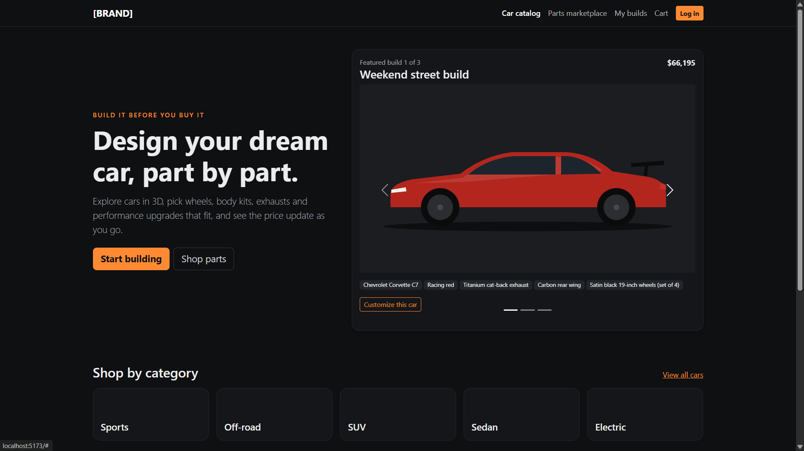
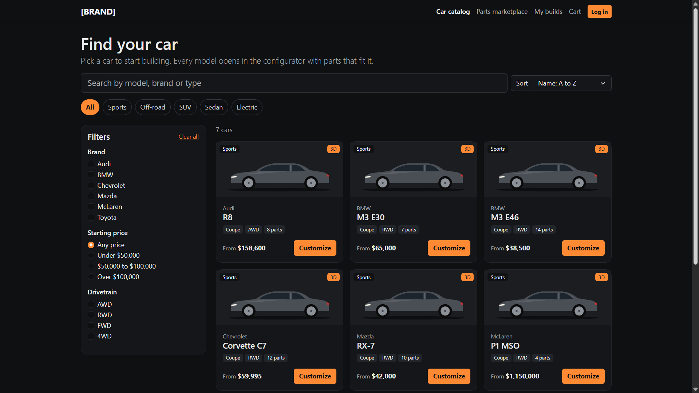

# 3D Car Configurator & Parts Marketplace

A full-stack web app where users pick a car, explore it in 3D, customize paint and aftermarket parts with live, server-checked pricing, save and share builds, and order compatible parts. Admins manage cars, parts, pricing, compatibility rules, orders and featured builds from a dashboard.

> Personal project. Car names are used for demo purposes only; 3D models are by their Sketchfab authors (credited on each car page).

## Screenshots

| Home | Catalog |
|---|---|
|  |  |

| Configurator | Parts marketplace |
|---|---|
|  |  |

| Cart & checkout | Admin dashboard |
|---|---|
|  |  |

## Features

**Customers**
- **Car catalog** with search, sorting and filters (brand, price, drivetrain), plus category browsing
- **Configurator** with an interactive 3D viewer (Sketchfab embeds), paint colors and finishes, and parts grouped by category
- **Compatibility rules**: only parts that fit the selected car are shown; "requires" and "conflicts with" rules are enforced in the UI *and* re-checked on the server
- **Live pricing** calculated server-side as the build changes
- **Save, rename, duplicate, delete and share builds** (public share links)
- **Parts marketplace** with fit filtering, search, filters and side-by-side comparison of up to 3 parts
- **Cart and checkout**: quantities, promo codes, delivery options, shipping form validation, mock payment and an order confirmation
- **Order tracking** with a status timeline on the account page
- **Accounts**: sign up, log in, forgot / reset password (JWT auth, bcrypt-hashed passwords)
- **Responsive** layout with a phone menu and slide-out filters

**Admins**
- Overview with orders, revenue, average order value, pending orders and low-stock alerts
- Order management with status updates and history
- Vehicles and parts: inline price and stock editing, show/hide, add new items
- Compatibility grid (which parts fit which cars) and part rules
- Choose featured builds for the home page carousel

## Tech stack

| Layer | Technology |
|---|---|
| Frontend | React, React Router, React-Bootstrap / Bootstrap 5, Three.js / React Three Fiber, Axios, Vite |
| Backend | Node.js, Express, JWT, bcrypt |
| Database | PostgreSQL (24 tables: catalog, compatibility, builds, cart, orders, payments, auth) |

**Design highlights**
- Prices and rules are always re-validated on the server, so totals can't be changed from the browser
- Checkout runs in a single database transaction (order, items, stock, payment) and locks stock rows to prevent overselling
- Order items store a copy of the price and name at purchase time
- Reusable UI components (cards, filter panel, modals, pill buttons) on top of React-Bootstrap, with a small custom theme

## Project structure

```
car-configurator/
  client/   React app (pages, components, API helper)
  server/   Express API (routes, services, auth middleware, seed script)
  db/       schema.sql
```

## Getting started

**Requirements:** Node.js (LTS) and PostgreSQL.

1. Create a database:
   ```
   psql -U postgres -c "CREATE DATABASE car_configurator;"
   ```
2. Set up the server:
   ```
   cd server
   npm install
   cp .env.example .env      # Windows: copy .env.example .env
   ```
   Edit `server/.env` and set `DATABASE_URL` and `JWT_SECRET`.
3. Create the tables and load sample data:
   ```
   npm run db:schema
   npm run db:seed
   ```
4. Start the server: `npm run dev` (http://localhost:5000)
5. In a second terminal, start the client:
   ```
   cd client
   npm install
   npm run dev
   ```
6. Open http://localhost:5173

**Demo logins** (created by the seed script)

| Role | Email | Password |
|---|---|---|
| Customer | demo@carconfig.local | Demo@12345 |
| Admin | admin@carconfig.local | Admin@12345 |

Promo code for testing: `BUILD10`

## Roadmap

- Live paint color changes on the 3D model (Sketchfab Viewer API)
- Photo uploads for cars and parts
- AI-generated preview images of finished builds
- Hosting, real payments and transactional emails
